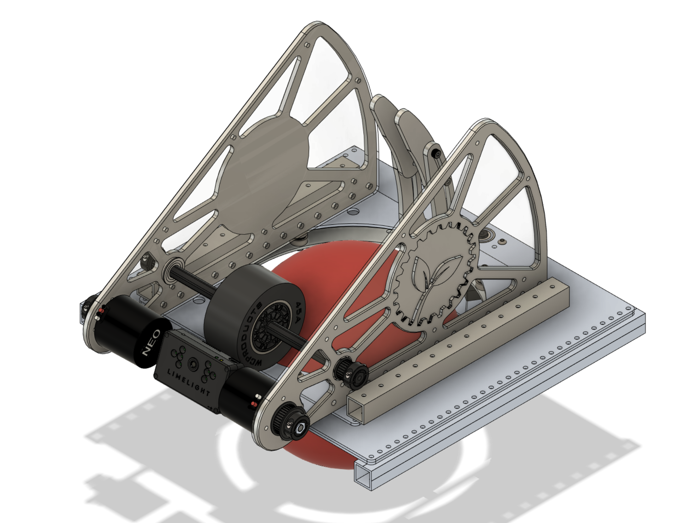
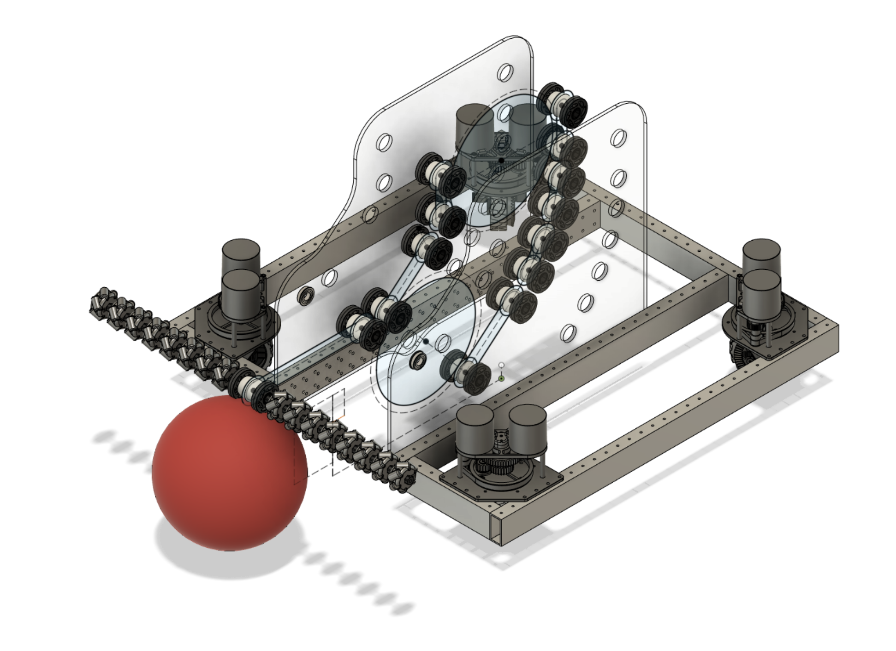
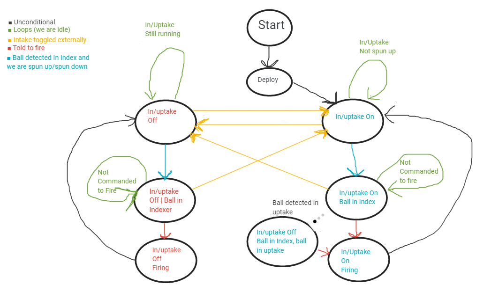

# 2022bot
Source code for the ESHS Robotics 2022 FRC Rapid React competition robot.

The robot's tentative name is **TATR** (The Articulated Turret Robot.)

This file contains [motor and port assignments](#motor-and-port-assignments), the robot's [control scheme](#control-scheme), and technical discussion about its various [subsystems](#subsystems).

## Control scheme ##

_Note_: for field-oriented swerve to work, the robot must start the match with
its front side facing away from the driver.

- XBox controller:
  1. Left joystick: **Field-oriented strafing**
      Regardless of the orientation of the robot, pushing the left joystick
      away from you will cause it to drive away from you; moving the joystick
      to the left will cause the robot to move leftward, and so on.
  2. Right joystick:
     1. Horizontal channel: **Rotation**
         Moving the right joystick to the right turns the robot clockwise;
         moving it to the left turns the robot counterclockwise.
     2. Vertical channel: _Unused_
  3. Right Trigger: **Manual Shoot**
      Pressing the button will release a ball from the indexer to the shooter
      manually.

## Motor and port assignments ##

Motor distribution is as follows:

### CAN bus IDs ###

- Drive subsystem:
    - Speed motors:
        1. Front left speed motor (Brushless NEO @ Spark MAX)
        2. Back left speed motor (Brushless NEO @ Spark MAX)
        3. Back right speed motor (Brushless NEO @ Spark MAX)
        4. Front right speed motor (Brushless NEO @ Spark MAX)
    - Pivot motors:
        5. Front left pivot motor (Brushless NEO @ Spark MAX)
        6. Back left pivot motor (Brushless NEO @ Spark MAX)
        7. Back right pivot motor (Brushless NEO @ Spark MAX)
        8. Front right pivot motor (Brushless NEO @ Spark MAX)
- Shooter subsystem:
  9. Turret turntable motor (Brushless NEO 550 @ Spark MAX)
      - This doesn't need a CAN ID because it will not require a
        ~~[CANEncoder](https://codedocs.revrobotics.com/java/com/revrobotics/canencoder)~~
        [SparkMaxAlternateEncoder](https://codedocs.revrobotics.com/java/com/revrobotics/sparkmaxalternateencoder)
        -- since we can get the set point from the vision subsystem, we can put
        this on PWM if we want.
  11. Left shooter flywheel (Brushless NEO @ Spark MAX)
  12. Right shooter flywheel (Brushless NEO @ Spark MAX)
- Intake/uptake subsystem:
  13. Indexer roller left (Brushless NEO 550 @ Spark MAX)
  10. Indexer roller right (Brushless NEO 550 @ Spark MAX)

### PWM ports ###

- Climber subsystem:
    - (PWM port number?) (name/purpose) motor (Brushless NEO @ Spark MAX)
        - Is this going to be PWM or CAN?
    - (PWM port number?) (name/purpose) motor (CIM @ Spark)
- Intake/uptake subsystem:
  0. Intake axle motor (Mini-CIM @ Spark)
  1. Uptake belt motor (Mini-CIM @ Spark)
- Shooter subsystem::
  - (PWM port numbers?) 2x hood motors (Linear servo @ Rev servo Hub)

## Subsystems ##
### Drive ###
[As the team
did](https://github.com/eshsrobotics/2020bot/blob/master/src/main/java/frc/robot/subsystems/NewWheelDriveSubsystem.java)
for the 2019-2020 and 2020-2021 seasons, this year's robot will employ a
swerve drive using MK3 modules from Swerve Drive Specialties.  Eight brushless
NEO motors control the swerve modules; their Spark MAX motor controllers are
daisy-chained in a CAN bus, allowingh us to use the CANSparkMAX
[SparkMaxRelativeEncoder](https://codedocs.revrobotics.com/java/com/revrobotics/RelativeEncoder.html)
or
[SparkMaxAlternateEncoder](https://codedocs.revrobotics.com/java/com/revrobotics/sparkmaxalternateencoder)
classes to access the default and alternate encoders for the pivot wheels'
motor controllers.

### Shooter ###

The shooter's purpose is to sink balls into the circular goal.  The goal is
ringed with reflective tape, and the center of that formation of reflective
quadrilaterals represents a **vision solution** that we can target with the
Limelight vision camera.

#### Shooter components ####

1. **Limelight.**  The Limelight is a versatile and easy-to-configure camera
   with built-in LED headlights designed to quickly identify reflective tape
   targets.  Once identified, it asynchronously calculates five parameters and
   returns them to the rest of the robot code via `NetworkTables`:
    - `tv`: Whether the Limelight has any valid targets; 0 or 1.
    - `tx`: Horizontal offset from crosshair to target; ranges from -27.0° to
      27.0°.
    - `ty`: Vertical offset from crosshair to target; ranges from -20.5° to
      20.5°.
    - `ta`: Target area in terms of percentage of the image.  Ranges from 0.0
      to 1.0.
    - `ts`: Target skew or rotation.  Ranges from -90.0° to 0.0°.

    From these values, we can use trigonometry to obtain the **solution
    distance**, and then feed that parameter into the [shooting
    algorithm](#shooting-algorithm).
2. **Flywheels and hood.** The shooter consists of a circular opening with a
   bottom flywheel adjacent to it.  A hood behind the opening can be adjusted
   to fine-tune the trajectory of the parabolic arc the launched cargo will
   travel in.

   The goal in the competition field contains a rotating agitator in the
   center.  If you are thinking of the agitators that you would see in washing
   machines, you are not far off the mark (except this one is larger and
   allows balls to slip through.)  The agitator seems specifically designed to
   thwart attempts to sink cargo in using high parabolic arcs with a lot of
   topspin, which is typical for flywheel-based shooters.

   In response, we added a second, rear flywheel to the design on 2022-01-19
   to reduce the topspin of the ball.

#### Shooting algorithm ####

- **Independent variables (inputs).**  There is one under consideration and a
   few others that we are ignoring:

    1. **Distance (d):** The diagonal distance from the Limelight camera to the
       center of the vision target.  The units don't actually matter.
    1. ~~Height: The distance from the Limelight camera to the ground plane.~~

        Always assumed to be constant.
    1. ~~Azimuth: The horizontal deviation in degrees from the center of the target.~~

        Because the shooter subsystem is always supposed to aim at the center of
        the vision solution, we can assume that this is a constant with a value
        of 0.0.

- **Dependent variables (outputs).**  These variables must be expressed as
  functions of the independent variables, and are directly related to the ball
  trajectory.  We have two variables under consideration and one that we are
  ignoring.

    1. **Bottom flywheel speed (s)**: The voltage to apply to the bottom flywheel.

        This controls the strength of the shot, and is achieved by
        compressing the cargo within the shooter.

    1. **Hood angle (θ)**: The amount by which the hood curls over the ball.

        This controls the steepness of the shot's trajectory.

    1. ~~Top flywheel speed: The voltage to apply to the top flywheel~~.

        Reduces topspin.  We plan to always make this a multiple of the bottom
        flywheel's speed, so it does not need to be considered in our model.

So our goal is to determine the two equations *F* and *G* so that
```
    s = F(d)
    θ = G(d)
```
will correctly launch the ball into the target from the given shooting distance `d`.

#### Gathering data ####

To gather enough data to solve the unknown equations for the dependent
variables, we need to position the robot (really, position the *Limelight*) at
fixed distances and heights and then attempt to find a flywheel speed and hood
angle that will reliably sink the shot.  The indexer should only release the
ball to the shooter once the flywheel has accelerated to the correct speed.

At the time of writing, we do not know what the relationship between the
distance and the independent variables is, other than that we predict that the
functions will monotonically increase as the distance increases.

### Intake ###


The intake subsystem is divided into three parts:

1. The *intake*, which consists of:
    - *Intake rollers* that use 3D-printed miniature Mecanum wheels to direct
      any cargo placed beneath them to the maw of the chassis; and
    - A downward-facing *intake color sensor* positioned at the top of the
      intake that ascertains whether a ball of the wrong color is positioned
      beneath the intake;
2. The *uptake*, which consists of:
   - *Uptake rollers*, which move balls up from the intake to the indexer; and
   - *The uptake sensor*, which tells us if a ball is detected within the
     uptake (i.e., it has passed the intake and it has not reached the
     indexer.)
3. The *indexer*, which consists of:
    - *Indexer belts*, which use encoders to offer precise control over
    when ball is released into the [shooter](#shooter); and
    - *The indexer sensor*, which tells if a ball is caught in the indexer.

For the intake rollers to work properly, cargo must be trapped in front of the
robot and pressed beneath the rollers so that they roll along the front
bumpers toward the front center.

#### Algorithm ####

The subsystem is controlled by a state machine.  The overarching goal is to
immediately transfer any ball that was not rejected by the intake into the
indexer, where it waits to be shot.



1. **Start**

    Initial state.

    *Next states*:

    - **Deploy** (unconditionally.)

2. **Deploy**

    In this state, the subsystem uses pneumatics to deploy the intake rollers
    to a down position.  The private `intakeAndUptakeEnabled` variable is set
    to `true` and the private `indexerReleased` variable is set to `false`.

    *Next states*:

    - **Deploy** (as long as the intake rollers are not down; this can be a
      simple timer.)
    - **Intake/Uptake On** (otherwise.)

3. Intake enabled branch:

    1. **Intake/Uptake On**

        In this state, the subsystem performs nominal ball intake.  In other words:

        - The *intake rollers*, *uptake rollers*, and *intake belts* are
          activated, bringing balls in and up.
        - If a ball of the wrong color is detected by the *intake color sensor*,
          then the intake rollers will reverse until the sensor is clear.

        *Next states*:

        - **Intake/Uptake Off** (if the `intakeAndUptakeEnabled` private variable
          is set to `false`; this can happen if a human driver command or the
          climber subsystem calls the intake subsystem's public `intakeDisable()`
          method.)
        - **Intake/Uptake On + Ball in Index** (if the *indexer sensor* detects
          the presence of a ball and the intake/uptake rollers are spun up -- the
          spin-up can use a simple timer.)
        - **Intake/Uptake On** (otherwise.)

    2. **Intake/Uptake On + Ball in Index**

        In this state, the system is ready to release a ball to the shooter.

        - The *indexer belts* are deactivated.
        - The *intake rollers* and *uptake rollers* remain enabled.

        *Next states*:

        - **Intake/Uptake Off** (if the `intakeAndUptakeEnabled` private variable
          is set to `false`; this can happen if a human driver command or the
          climber subsystem calls the subsystem's public `intakeDisable()`
          method.)
        - **Intake/Uptake On + Firing** (if the `indexerReleased` private
          variable is set to `true`; this can happen if a human driver command or
          the vision subsystem has called the intake subsystem's public
          `releaseToShooter()` method.)
        - **Intake/Uptake On + Ball in Index** (otherwise.)

    3. **Intake/Uptake On + Firing**

        In this state, the *indexer belts* and *uptake rollers* release balls
        into the shooter until the uptake and indexer are empty.  When this is
        done, `indexerReleased` is set back to `false`.

        *Next states*:

        - **Intake/Uptake On** (if a minimum amount of time has passed and the
          *indexer sensor* does not detect a ball.)
        - **Intake/Uptake On + Firing** (otherwise.)

4. Intake disabled branch:

    1. **Intake/Uptake Off**

        In this state, the *intake rollers*, *uptake rollers*, and *intake
        belts* spin down and performs no intake or uptake.

        *Next states*:

        - **Intake/Uptake On** (if the `intakeAndUptakeEnabled` private
          variable is set to `true`; this can happen if a human driver command
          or autonomous calls the intake subsystem's public `intakeEnable()`
          method.)
        - **Intake/Uptake Off + Ball in Index** (if the *indexer sensor* detects
          the presence of a ball and the intake/uptake rollers are spun down -- the
          spin-down can use a simple timer.)
        - **Intake/Uptake Off** (otherwise.)

    2. **Intake/Uptake Off + Ball in Index**

        In this state, the system is ready to release a ball to the shooter.
        The *indexer belts*, *intake rollers*, and *uptake rollers* are
        deactivated.

        *Next states*:

        - **Intake/Uptake On** (if the `intakeAndUptakeEnabled` private
          variable is set to `true`; this can happen if a human driver command
          or autonomous calls the intake subsystem's public `intakeEnable()`
          method.)
        - **Intake/Uptake Off + Firing** (if the `indexerReleased` private
          variable is set to `true`; this can happen if a human driver command or
          the vision subsystem has called the intake subsystem's public
          `releaseToShooter()` method.)
        - **Intake/Uptake Off + Ball in Index** (otherwise.)

    3. **Intake/Uptake Off + Firing**

        In this state, the *indexer belts* and *uptake rollers* release balls
        into the shooter until the uptake and indexer are empty.  When this is
        done, `indexerReleased` is set back to `false`.

        *Next states*:

        - **Intake/Uptake Off** (if a minimum amount of time has passed and the
          *indexer sensor* does not detect a ball.)
        - **Intake/Uptake Off + Firing** (otherwise.)

# Absolute alignment values
- Front left: ~166.0 degrees
- Back left: ~17.8 degrees
- Back right: ~255.0 degrees
- Front right: ~202.0 degrees

